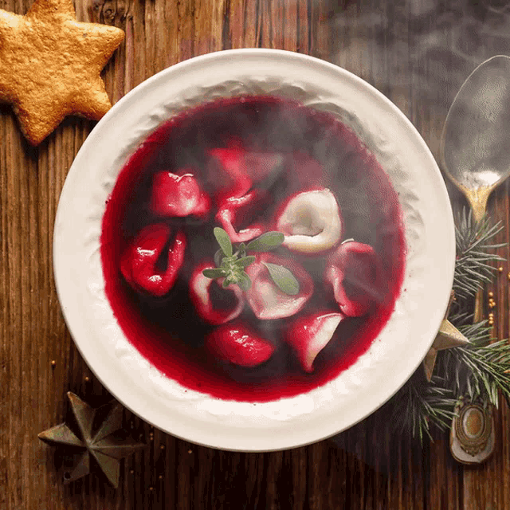
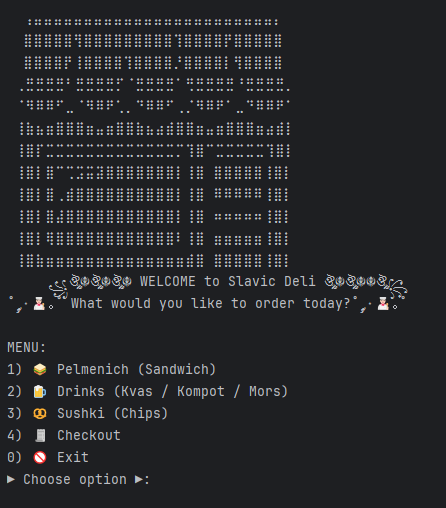
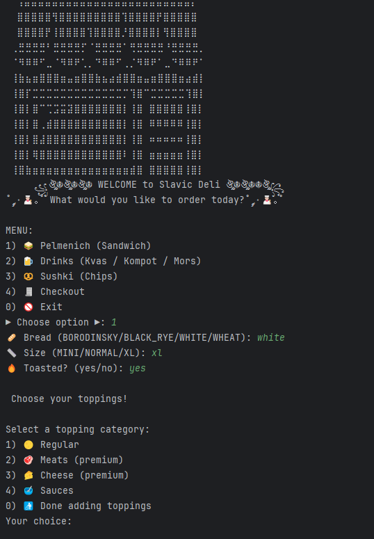
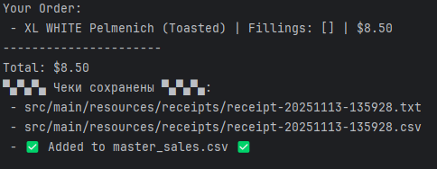

# 🌶️ Designed by ***Dzianis Hamarko***
### (aka the Slavic Deli Architect)

## Slavic Deli is a Java console application that lets users create a fully customized Slavic-style meal through a simple and interactive menu system. The centerpiece of the app is the Pelmenich sandwich, which can be built to order by selecting the bread type, sandwich size, and whether it should be toasted. Users can then choose from a wide range of toppings broken into clear categories: regular vegetables, sauces, meats, and cheeses. Premium toppings, such as meats and cheeses, automatically increase the final price based on the size of the sandwich, creating a realistic and dynamic pricing system.

## Beyond sandwiches, the app also includes traditional Slavic drinks like Kvas, Kompot, and Mors, each available in multiple sizes, as well as Sushki chips in several flavors. Once the user completes their order, the system generates a detailed receipt in both text and CSV format and logs every sale in a master CSV ledger. This makes it easy to track orders and view total sales over time.

_The project is organized into clean, modular classes for sandwiches, drinks, toppings, orders, and receipts. This structure keeps the code easy to read, easy to maintain, and flexible for adding new features in the future, such as desserts, combo meals, or loyalty rewards. The app demonstrates strong use of object-oriented design, enums, and Java I/O while keeping the user experience simple and approachable._

------------------------------------------------------------------------------------------------------------------------

✨ Highlights ✨

1)Fully object-oriented

2)Clean separation of concerns
 
3)UTF-8 ASCII art welcome screen

4)Auto-folder creation

5)CSV export for spreadsheets

6)Switch expressions & enums for clean input handling

7)Modular design ready for expansion

## Interesting code in my project will be in RceiptWriter 

      new java.io.File("src/main/resources/receipts").mkdirs();
automatically creates the entire receipts folder path.
----------------------------------------------------------------

## ☁︎ UI MENU ☁︎

## ☁︎ Depends on your selection, there's multiple options ☁︎

## ☁︎ Finally, when you done, receipts are saved ☁︎

## **Slavic Deli isn’t just a project : its structure makes it fully adaptable for real business use. Because the menu, pricing, toppings, receipts, and sales tracking are all automated and handled through separate classes, the system can easily be expanded into a full point-of-sale tool for cafés, food trucks, delis, or small restaurants. With a connected database or UI layer, this codebase could power real ordering terminals, self-checkout kiosks, or online ordering systems with very minimal changes.**

