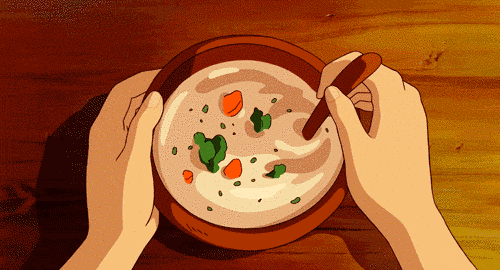

## Designed by Dzianis Hamarko

## Slavic Deli is a simple Java console app where you can build your own Slavic-style meal. You can make a custom Pelmenich sandwich by choosing the bread, size, toast level, and all the toppings you want, including regular veggies, sauces, and premium meats or cheeses that change the price. You can also add drinks like Kvas, Kompot, or Mors, plus Sushki chips.

## When you check out, the app automatically creates a text and CSV receipt and updates a running sales log. Everything is organized into separate classes, which keeps the project clean, easy to follow, and ready for more features later.

------------------------------------------------------------------------------------------------------------------------

✨ Highlights

Fully object-oriented

Clean separation of concerns

UTF-8 ASCII art welcome screen

Auto-folder creation

CSV export for spreadsheets

Switch expressions & enums for clean input handling

Modular design ready for expansion